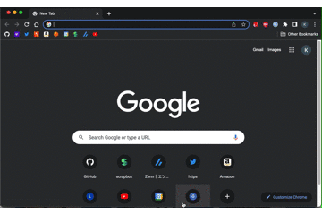
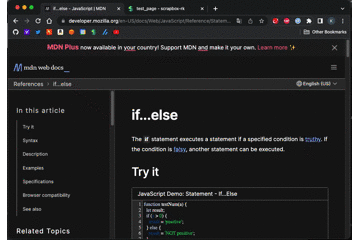
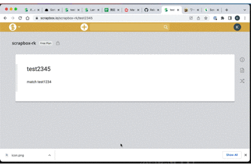
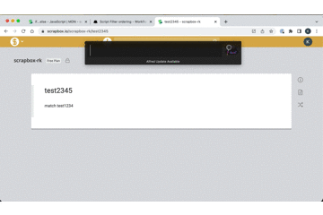

# scrapbox-alfred-workflow

This workflow enables you actions below on **only Google Chrome**.

Actions are implemented by JXA(JavaScript for AppleScript) and Ruby.

- create new page
- copy scrapbox link to clipboard
- create bookmark page
- list pages
- search pages

## Installation

1. install latest workflow package into alfred from [release page](https://github.com/uma-the390/scrapbox-alfred-workflow/releases)
2. set environment variables

environment variables

| name         | example                | description                                             |
| :----------- | :--------------------- | :------------------------------------------------------ |
| bookmark_tag | my-bookmarks           | tag name for bookmarkd pages generated by this workflow |
| endpoint     | scrapbox.io            | change if your project is enterprise                    |
| project_id   | my-notebook            | your scrapbox project name                              |
| token        | sfejiiejijve774hjjfiej | connect.sid of your scrapbox cookie                     |
|              |

## Usage
### sb new

open new page

### sb url

copy current tab url in scrapbox format.

### sb bookmark

create bookmark page for current tab

### sb list

list recent 100 pages

### sb search {query}

search pages.

Pages matched with title are listed above.

## Others

icon.png are quoted from https://scrapbox.io/help-jp/Scrapbox
