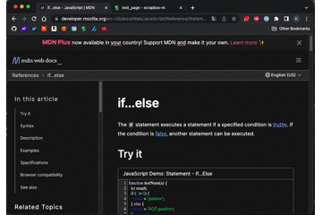

# scrapbox-alfred-workflow

This workflow enables you to actions below on Google Chrome.

Actions are implemented by JXA(JavaScript for AppleScript).

- create new page
- copy scrapbox link to clipboard
- create bookmark page

## Installation

1. install workflow package into alfred
2. set environment variables

environment variables

| name         | example      | description                                           |
| :----------- | :----------- | :---------------------------------------------------- |
| bookmark_tag | my-bookmarks | tag name for bookmarkd pages created by this workflow |
| project_name | my-notebook  | your scrapbox project name                            |

## Usage

commands

| command                | description                                                                                                 |
| :--------------------- | :---------------------------------------------------------------------------------------------------------- |
| sb new <new page name> | create new scrapbox page                                                                                    |
| sb url                 | convert active chrome tab url to scrapbox form url like "[page_tile \| https://...]", and copy to clipboard |
| sb bookmark            | creage bookmark page of active chrome tab                                                                   |

### sb new

### sb url

### sb bookmark

